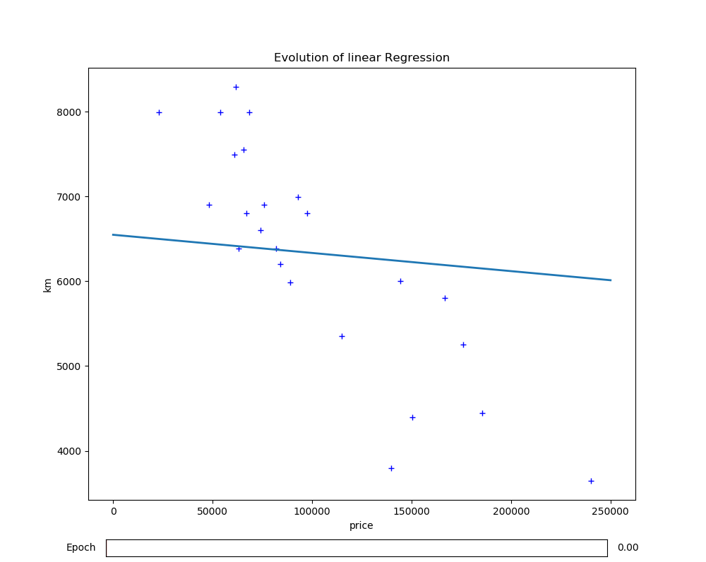
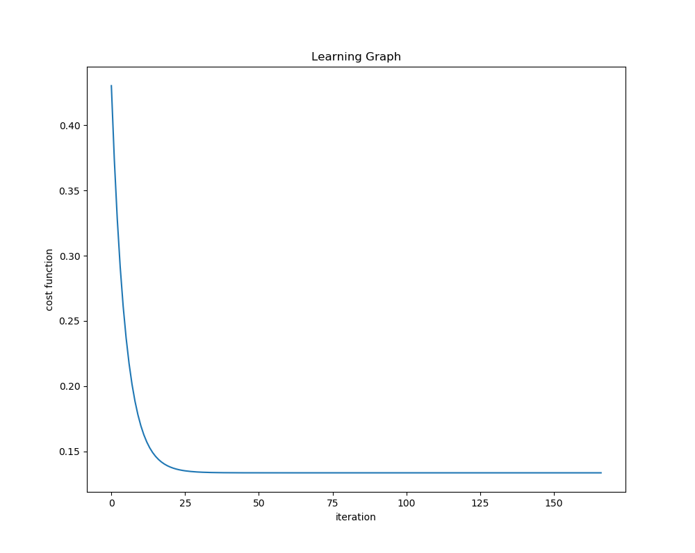
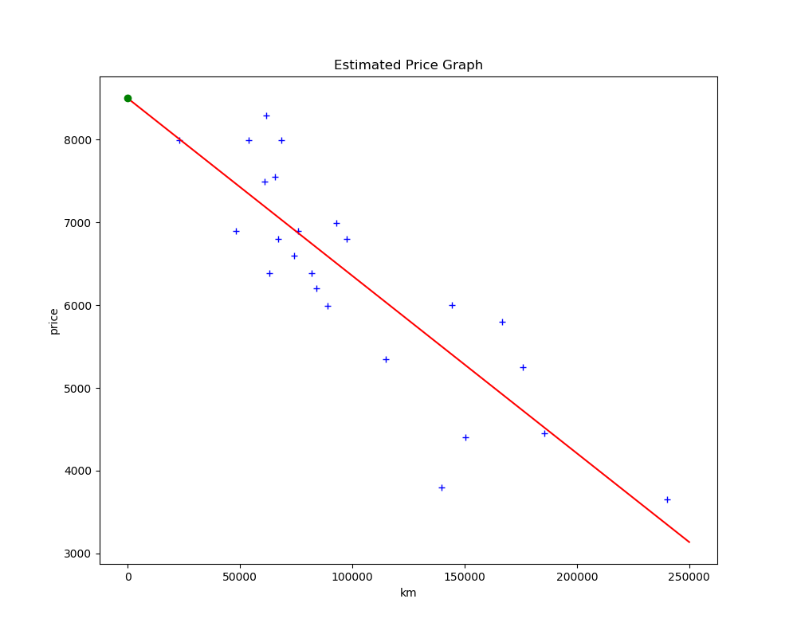

# ft_linear_regression [(sujet)](https://cdn.intra.42.fr/pdf/pdf/3505/ft_linear_regression.fr.pdf)

## Introduction

Machine learning is a growing field of computer science that may seem a bit complicated and reserved only to mathematicians. You may have heard of neural networks or
k-means clustering and don’t undersdand how they work or how to code these kinds of
algorithms...
But don’t worry, we are actually going to start with a simple, basic machine learning
algorithm.

## Objective

The aim of this project is to introduce you to the basic concept behind machine learning. For this project, you will have to create a program that predicts the price of a car by using a [linear function](https://en.wikipedia.org/wiki/Linear_function) train with a [gradient descent algorithm](https://en.wikipedia.org/wiki/Gradient_descent).
We will work on a precise example for the project, but once you’re done you will be
able to use the algorithm with any other dataset.

## Formulas

### Install
<pre>
<code>git clone </code>
<code>python -m pip install -r lib.txt</code></pre> 

### Usage
To train our model
<pre><code>python train.py</code>
This will save the weights trained in `./data/theta.txt`
</pre>

To predict a value
<pre><code>python main.py</code>
Enter a mileage: n
With: n km, the estimated price is : x
</pre>

